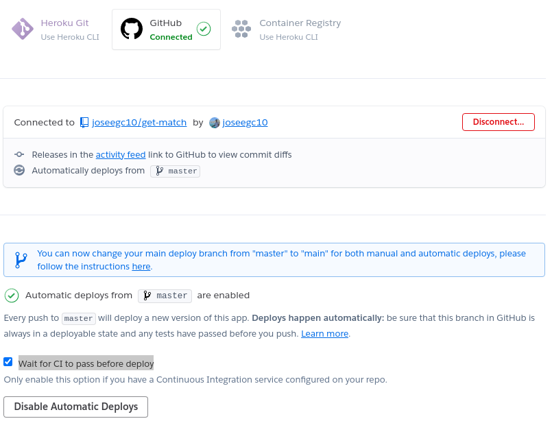
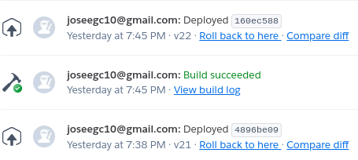

# Heroku

He elegido **heroku** como PaaS para desplegar mi microservicio. Los motivos son los siguientes:

- Es muy adecuado para **principiantes**, puesto que ofrece un plan gratuito y es muy sencillo realizar el despliegue.
- Inicialmente, Heroku se creó para el **lenguaje Ruby**, por lo que podemos garantizar un adecuado soporte para este lenguaje.
- Conexión sencilla con **github**, permitiéndo establecer la necesidad de que se ejecuten los servicios de integración continua antes de realizar el despliegue.
- Permite el uso de **addons** (de forma muy sencilla) que nos ofrecen servicios como bases de datos, sistemas de logs, etc.
- Compatibilidad con **Docker**, permitiendo realizar un Dockerfile a partir del cual realizar el despliegue, por lo que existe la posibilidad de mudarnos fácilmente a otro PaaS que soporte Docker en el caso de que sea necesario.

## Despliegue y configuración para despliegue automático

El despliegue del microservicio de puede realizar de dos formas. La primera es desde el CLI de heroku, teniendo que seguir los siguientes pasos:

- Nos vamos a la carpeta en local donde tengamos nuestro proyecto de github.
- Hacemos `heroku login` para loguearnos con nuestra cuenta de heroku.
- Creamos la aplicación con el comando `heroku create get-match --region eu`. Como podemos ver, estamos indicando la region de Europa que tanto por temas legales como por cercanía es la que debemos usar.
- Ejecutamos `git push heroku master` para hacer el deploy.

La otra opción es crear la app de heroku desde la interfaz web. Para ello, nos vamos a la página principal de heroku y le damos a crear nueva app. Tras ello, elegimos el nombre y la región y le damos a crear. 

Para conectar nuestra app con el repositorio de github, nos vamos al apartado Deploy y en Deploy method indicamos github, conectándonos con nuestra cuenta e indicante el repo que queremos conectar. Con esto, cada vez que hagamos push a nuestro repositorio de github se va a hacer deploy a heroku.

Sin embargo, **no es correcto que en cada push se haga deploy a heroku**, ya que este despliegue solo se debe hacer en el caso en el que los test pasen. Para ello, volvemos al apartado mencionado en el parrafo anterior, es decir, al apartado Deploy y en Automatic Deploys marcamos la opción `Wait for CI to pass before deploy`. Con esto, será necesario que no fallen los test que pasamos en los sistemas de integración continua conectados con nuestro repositorio de github para que se realice el deploy a heroku. Con lo anterior, el apartado deploy quedaría de la siguiente forma:

Como prueba de la correcta integración de los sistema de ci con Heroku, mostramos un ejemplo de cada caso. En primer lugar, vemos como un commit que pasa todos los tests provoca un deploy en heroku:

Mostramos ahora un commit que no ha producido un deploy en heroku:

Como vemos en las dos imágenes anteriores, el commit anterior al 160ec588 si que está en git pero no esta en heroku, ya que dicho commit anterior no pasó los tests de circleci, como vemos en la siguiente imagen:

## Variables de entorno

Lo siguiente que tenemos que hacer es establecer las variables de entorno a utilizar por heroku. Estas variables son las que se explicaron en la [documentación sobre la configuración distribuida](../microservicio/conf_logs.md), con algún cambio. En primer lugar, se ha eliminado la **variable PORT**, ya que heroku establece el puerto por nosotros, por lo que no es posible indicarle un puerto particular. Además, se han creado dos variables para la conexión con la base de datos, estas son **URI_DATABASE** y **SECRET_DATABASE**. Por tanto, se han modificado los métodos de configuración distribuida que expliqué en la documentación enlazada anteriormente para que tanto en etcd como en figaro se pruebe a pedir estas variables.

Para establecer dichas variables en heroku, nos vamos al apartado Settings y le damos a Reveal Config Vars. Ahí vamos añadiendo las variables mencionadas anteriomente.

## Modo de test

Además, se ha añadido un nuevo valor posible para la variable APP_ENV, pues ahora existe el **modo test**. Este modo nos va a servir para realizar los **test de integración** de nuestro microservicio. Como se comentará en la documentación sobre [bases de datos](../bd.md), se ha creado una base de datos en firebase que va a proporcionar la capa de persistencia a mi aplicación. Sin embargo, el dator creado para firebase no nos va a permitir realizar los tests de integración, puesto que no es sencillo levantar un contenedor que permita realizar los tests y desaparezca tras ellos. Por eso, me ayudo de este modo de ejecución de la aplicación para establecer que en el caso de ejecutar la aplicación en modo test, el dator que se usará en la capa de persistencia va a ser el dator explicado en el apartado diseño por capas del [siguiente documento](../microservicio/api.md), el cual usa solamente peristencia en memoria.

Las variables de configuración distribuida, como ya se explicó, en el caso de que no se encuentren todas en etcd o figaro, se van a obtener de las variables de entorno. En caso de que no se encuentren, se tomará un valor por defecto, pero este valor por defecto nos sirve para el caso de que estemos ejecutando la aplicación en modo production o development, puesto que necesitamos un valor adecuado para la base de datos. Por tanto, es necesario establecer estas variables en heroku, realizando esto de la forma que se explicó anteriormente.

## Logs

En cuanto a los logs, se va a seguir usando lo que ya se explicó en el [documento sobre los logs y la configuración distribuida](../microservicio/conf_logs.md), con un cambio, pues ahora en producción no vamos a pasar los logs a un archivo a parte, pues no tendría sentido porque al desplegarlo en heroku estaríamos perdiendo los logs. Por tanto, los logs van ahora por la salida estándar con cualquier modo de ejecución de la API, haciendo uso de los logs de heroku para observar que ocurre en la aplicación. Para obtenerlos, ejecutamos la siguiente orden:

`heroku logs -a get-match --tail`