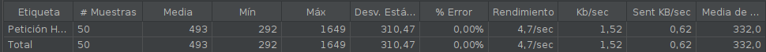
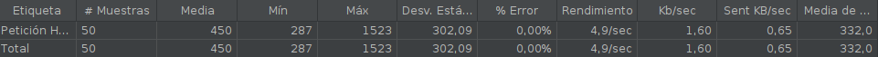
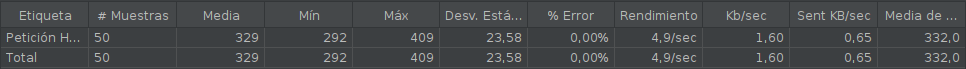
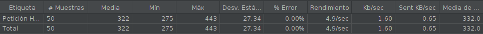
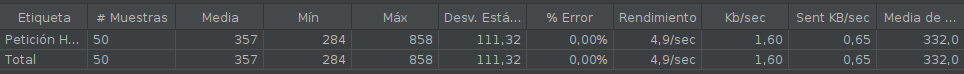
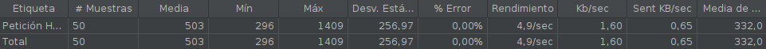

# Gestor de procesos y pruebas de prestaciones

## Gestor de procesos

Como gestor de procesos, he querido hacer uso de una herramienta que me permitiera una **integración total** con mi proyecto de ruby, es decir, un gestor de procesos que consistiera en una gema de ruby.

En primer lugar, estuve aprendiendo sobre la **gema 'god'**. Esta gema es bastante fácil de configurar, pues funciona en base a lo que llama relojes. Un reloj consiste en una estructura en la cual le indicamos el nombre del proceso, como se arranca, se detiene, si se mantiene vivo siempre o no, etc. Por tanto, debemos crear una archivo .god y añadir un reloj con nuestro proyecto en él:

```ruby
God.watch do |w|
  w.name = "get-match"
  w.dir = "."
  w.pid_file = "#{w.name}.pid"
  w.start = "rackup -D config.ru -p 9292 -P #{w.pid_file}"
  w.keepalive
end
```

Como vemos, el reloj anterior nos va a generar el proceso llamado get-match, arrancándolo mediante rackup y manteniendolo vivo. Por tanto, se ejecutamos `god -c fichero.god`, se arrancará el proceso god que se va a encargar de ejecutar nuestros procesos. El proceso get-match lo arranca por defecto, pudiendo ejecutar las siguiente órdenes para pararlo, arrancarlo, reiniciarlo o monitorizarlo:

```bash
god stop get-match
god start get-match
god restart get-match
god log get-match
```

Sin embargo, a pesar de la enorme simpleza que me aporta esta herramienta, he descartado su uso. El motivo ha sido que no he encontrado opciones por ejemplo para levantar varias instancias de mi aplicación, es decir, de forma sencilla, solo podemos hacer las operaciones básicas que he comentado anteriormente, y si nos salimos de ahí la herramienta comienza a coger una excesiva complejidad.

Por tanto, se va a hacer uso de otro gestor de procesos, **foreman**. Este, además de ser una gema de ruby y de tener un funcionamiento simple, me permite la ejecución de varias instancias de mi aplicación, pudiendo hacer estas operaciones más complejas de forma simple también. Para la ejecución de más de un proceso del mismo tipo, existe la siguiente orden:

`foreman start -c web=2`

Con la cual ejecutamos dos procesos web, donde web esta definido en el Procfile. Además, foreman toma el fichero Procfile para saber que proceso tiene que ejecutar, el cual ya teníamos creado por Heroku, no teniendo que hacer este trabajo extra. 

Como última razón, foreman es útil tanto para ejecutar el API en desarrollo, haciendo uso de lo anterior, como para ejecutarla en producción. Para esto, tiene la orden `foreman export`, la cual nos permite exportar a upstart o standard unix init.

Por tanto, se ha creado una tarea en mi fichero [Rakefile](../../Rakefile), start, la cual ejecuta la orden `foreman start`, ejecutando lo que teníamos en nuestro fichero [Procfile](../../Procfile), es decir, la orden `bundle exec rackup config.ru -p $PORT`, por lo que se ejecuta lo que tengamos en nuestro fichero de configuración [config.ru](../../config.ru).

## Pruebas de prestaciones

Por tanto, una vez he elegido Foreman como gestor de procesos, este me va a servir para saber cual es el numero de instancias de mi aplicación que es mejor levantar en Heroku. Esto se hacía con la orden `foreman start -c web=2` donde en este caso se estarían levantando dos instancias de mi aplicación.

Para poder saber que número es mejor, se ha usado la herramienta Jmeter. Lo que he hecho es añadir al plan de prueba un grupo de hilos y un reporte resumen que me permita saber las diferentes métricas. En cuanto al grupo de hilos, este consiste en 50 usuarios haciendo peticiones y se ha creado una petición HTTP para este grupo que lo que hace es una solicitud GET a la ruta /equipos. El elegir esta ruta pienso que representa una situación real de mi aplicación, pues en realidad todas las peticiones a mi API son muy similares, es decir, hacemos una petición más o menos del mismo tamaño a la base de datos y devolvemos el resultado. Por tanto, una vez está creada la liga, lo que podemos hacer es hacer peticiones a mi API para obtener información de dicha liga, por lo que cualquier ruta que hubiera elegido pienso que sería muy similar.

Por tanto, se han hecho varios despliegues a heroku modificando el valor de web en el comando de foreman indicado anteriormente, obteniendo los siguientes resultados:

- web=1


- web=2


- web=3


- web=4


- web=5


- web=6


Recogiéndolo en una tabla de resultados, obtenemos lo siguiente:

| # Instancias | # Muestras | Media   | Min    | Max      | Desv. Est. | Error % | Rendimiento | KB/sec |
| ------------ | ---------  | ------- | ------ | -------- | --------   | ------- | ----------  | ------ |
| 1            | 50         | 493     | 292    | 1649     | 310        | 0.00%   | 4.7/sec     | 1.52   |
| 2            | 50         | 450     | 287    | 1523     | 302        | 0.00%   | 4.9/sec     | 1.60   |
| 3            | 50         | 329     | 292    | 409      | 23         | 0.00%   | 4.9/sec     | 1.60   |
| 4            | 50         | 322     | 275    | 443      | 27         | 0.00%   | 4.9/sec     | 1.60   |
| 5            | 50         | 357     | 284    | 858      | 111        | 0.00%   | 4.9/sec     | 1.60   |
| 6            | 50         | 503     | 296    | 1409     | 256        | 0.00%   | 4.9/sec     | 1.60   |

Como se puede observar, cuando aumentamos el número de instancias de 1 a 2, conseguimos mejorar todas las métricas anteriores. Además, cuando pasamos de 2 a 3, conseguimos el mayor salto de mejora, pues la media de latencia se reduce bastante y conseguimos una menor desviación estandar ya que nuestro valor Min y Max se parecen mucho más.

Entre 3 y 4 ya existe muy poca diferencia, pues la media de latencia prácticamente es igual y en el resto de métricas pasa lo mismo. Por tanto, pienso que cualquiera de estos dos valores es adecuado.

Por último, vemos que cuando subimos de 4 ya tanto la latenca media como la desviación estandar comienza a aumentar bastante, sobre todo en el paso de 5 a 6, por lo que estos valores quedan descartados.

Como conclusión, cualquiera de los valores 3 y 4 son adecuados, pero decido quedarme con el valor 4 pues se reduce un poco la latencia media.