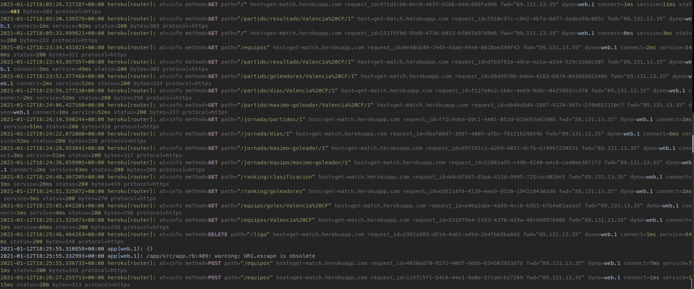

# Correcto despliegue en PaaS y diseño del API

Siguiendo los pasos del documento anterior, conseguimos acceder al API a través de [https://get-match.herokuapp.com/](https://get-match.herokuapp.com/).

En cuanto al diseño del API, se puede consultar en el siguiente [documento](../microservicio/api.md) las diferentes capas de mi API y su correspondencia con las HUs. En resumen, establecemos que en la API se han diseñado las siguientes rutas:

```ruby
# HU1: Como usuario, quiero poder consultar el resultado de un partido
get '/partido/resultado/:equipo/:jornada'
# HU2: Como usuario, me gustaría poder consultar los goleadores de un partido
get '/partido/goleadores/:equipo/:jornada'
# HU3: Como usuario, me gustaría poder consultar los días que hace que se jugó un partido o los días que quedan para que se juegue
get '/partido/dias/:equipo/:jornada'
# HU4: Como usuario, debo poder consultar el máximo goleador de un partido
get '/partido/maximo-goleador/:equipo/:jornada'
# HU6: Como usuario, me gustaría poder consultar los partidos de una jornada
get '/jornada/partidos/:jornada'
# HU7: Como usuario, me gustaría consultar el tiempo que queda para que empiece una jornada o desde que empezó
get '/jornada/dias/:jornada'
# HU8: Como usuario, me gustaría poder consultar el máximo goleador de una jornada
get '/jornada/maximo-goleador/:jornada'
# HU9: Como usuario, me gustaría poder consultar el equipo más goleador de una jornada
get '/jornada/equipo/maximo-goleador/:jornada'
# HU10: Como usuario, me gustaría poder consultar los equipos que participan en una liga
get '/equipos'
# HU11: Como usuario, me gustaría poder consultar el ranking de goleadores de una liga
get '/ranking/goleadores'
# HU12: Como usuario, me gustaría poder consultar la clasificación de una liga
get '/ranking/clasificacion'
# HU13: Como usuario, me gustaría poder consultar el número de goles que ha metido un equipo en una liga
get '/equipo/goles/:equipo'
# HU14: Como usuario, quiero poder añadir un equipo a una liga
put '/equipos/:nombre'
# HU15: Como usuario, quiero poder añadir un partido a una jornada de la liga
put '/partidos/:numJornada/:equipo'
# HU16: Como usuario, quiero poder añadir una jornada a una liga 
put '/jornadas/:numJornada'
```

Comentar que los métodos put se han corregido puesto que anteriormente en sus rutas se hacía uso de verbos, algo que no seguía las buenas prácticas. Ahora simplemente se menciona la entidad que vamos a añadir a la liga.

Además, en este último desarrollo del proyecto se han añadido dos HUs que se han visto necesarias. Estas son:

```ruby
# HU19: Como usuario, quiero poder resetear la liga
delete '/liga'
# HU20: Como usuario, debo poder acceder a la información de un equipo 
get '/equipos/:equipo'
```

La creación de dichas rutas ha seguido la misma estructura que ya se explicó en el [documento de diseño del API](../microservicio/api.md). 

En cuanto a la HU19, necesitamos alguna forma de resetear una liga, puesto que una vez se han jugado todas las jornadas la liga vuelve a empezar. Por ello, se ha añadido este método delete, que nos elimina todos los componentes de la liga (jornadas, partidos, clasificación...), dejándola lista para volver a empezar.

En cuanto a la HU20, no se tenía una ruta que devolviera toda la información de un equipo, por lo que era necesaria su creación.

Además, se ha creado la ruta /status que devuelve `{status:"OK"}`

Por último, mostramos algunas pruebas del correcto despliegue en heroku. En mi API, vamos a devolver status 404 en el caso de que nos pidan un recurso que no existe o status 200 en el caso de que se realice todo de forma correcta. Podemos ver que en todas las peticiones obtenemos status 200:

