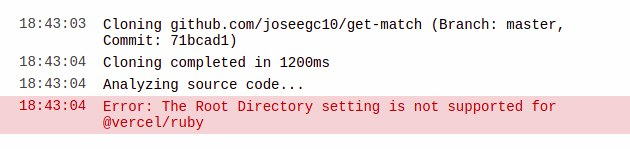
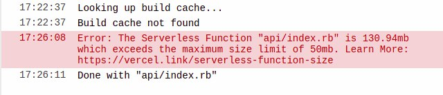
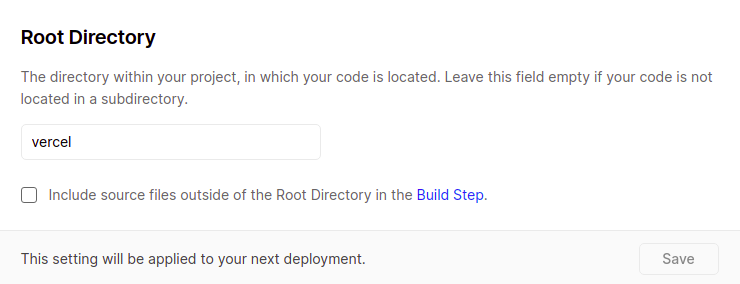
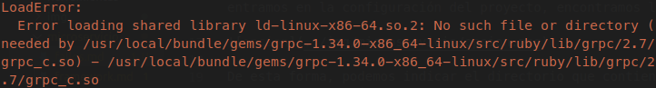

# Errores solucionados

## Vercel

En primer lugar, he tenido que solucionar un problema con Vercel. En el caso de ruby, este lenguaje se encuentra en fase alpha para Vercel. Por ello, cuando importamos un proyecto no podemos indicar la carpeta que contiene el código de la función Serverless, es decir, el directorio root, obteniendo el siguiente error en el caso de que queramos cambiarla:



Por ello, en un primer momento tuve que subir todo el código de mi repositorio, pues me obligan a que la carpeta api que contiene el código de Vercel se encuentre en la carpeta principal del repo. Debido a esto, una vez ha aumentado considerablemente el tamaño de mi repositorio, cuando hacíamos un push a git y hacíamos deploy a Vercel de todo el repo, obteníamos el siguiente error:



Esto nos indica que lo que estamos subiendo a Vercel es demasiado pesado.

En principio puede parecer que para ruby no tengamos solución, pues al encontrarse en fase alpha hay que subir todo el código. Sin embargo, si nos vamos a nuestro proyecto en Vercel una vez está creado (con root=.) y entramos en la configuración del proyecto, encontramos la siguiente opción:



De esta forma, podemos indicar el directorio que contiene el código de la función Serverless y podemos desmarcar la opción de que incluya lo archivos fuera del directorio root, quedando el problema del tamaño solucionado.

Por ello, lo que he hecho es crearme una carpeta vercel en mi repositorio y he mentido ahí dentro la carpeta api que contiene el archivo con la función serverless.

## Dockerfile

El segundo error que tuve que solucionar fue una incompatibilidad en mi imagen Docker. En mi caso hago uso de alpine como imagen base. Al haber añadido nuevas gemas para la creación del microservicio, se creó una incompatibilidad de una de las nuevas gemas con alpine, obtiendo el siguiente error una vez queríamos hacer los test del código en la imagen:



Básicamente, la gema grpc es una gema que se instala por una dependencia con una de las gemas que tengo en mi Gemfile. Sin embargo, cuando se usa se espera que exista una carpeta que en mi imagen de alpine no existe. Para arreglar esto he añadido lo siguiente al Dockerfile:

```Dockerfile
RUN apk add libc6-compat &&\
    ln -s /lib/libc.musl-x86_64.so.1 /lib/ld-linux-x86-64.so.2
```

Lo que hacemos es instalar la libreria libc6-compact necesaria para el uso de la gema mencionada. Además, creamos un enlace simbólico desde donde dicha gema espera encontrar el código hasta donde está realmente, para que cuando la lea, la encuentre.
