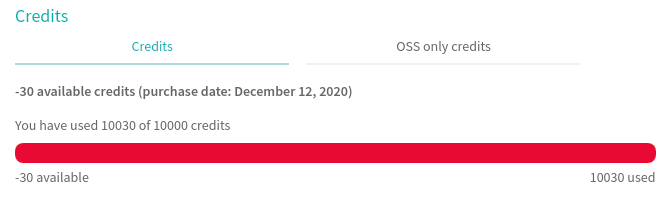
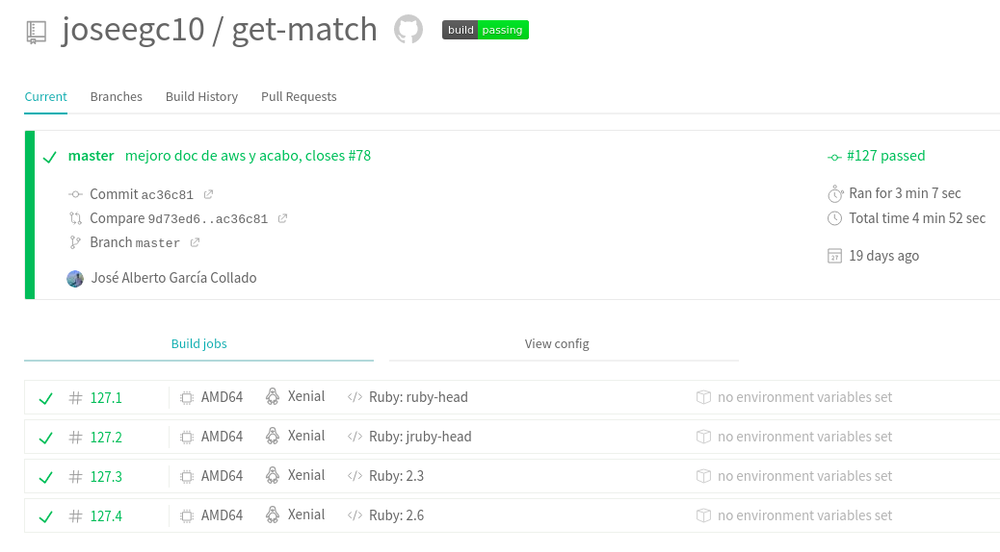
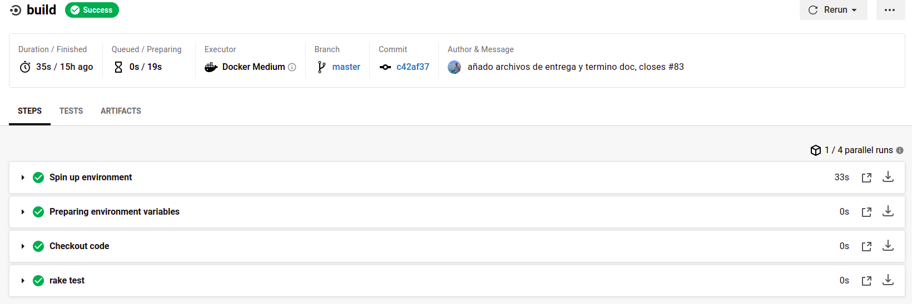

# Créditos de Travis

Para justificar que en algún momento Travis si que funcionaba en mi proyecto, podemos ver el último commit con el que se ejecutó. El commit es [este](https://github.com/joseegc10/get-match/commit/0b77b32891c15ef44aae704127d24578c7cd8aae) y podemos ver que en los sucesivos commits Travis directamente no se ejecuta. Esto es debido a lo siguiente:

Como vemos, no tengo disponible ningún crédito, por lo que esto es el motivo de que no se ejecute. Sin embargo, si nos vamos a la página de Travis, ahí podemos ver que la última vez que se ejecuto si funcionaba de forma correcta:

Lo anterior también se puede demostrar consultando el siguiente [enlace](https://github.com/joseegc10/get-match/runs/1443280492).

Además, para comprobar que pasan los tests con el código actual, podemos fijarnos en CircleCI. La documentación sobre este sistema se puede consultar [aquí](../circleci/circleci.md). En él, cogemos la imagen Docker e intentamos pasar los test, que como puede verse en la siguiente imagen, pasan de forma correcta:

Esto también se puede demostrar en el siguiente [enlace](https://github.com/joseegc10/get-match/runs/1539231869).