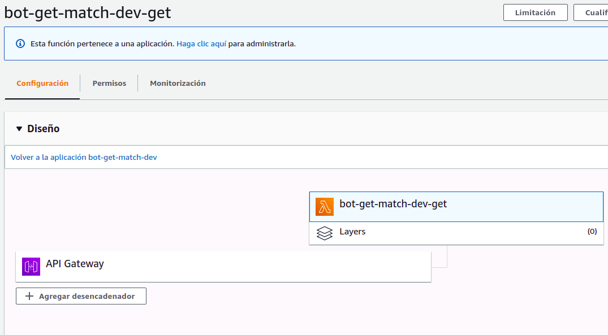
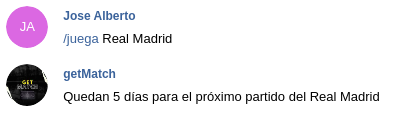
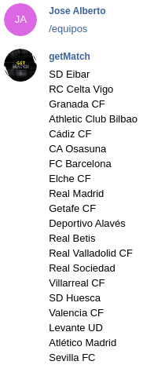
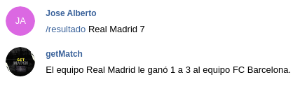

# AWS Lambda

AWS Lambda es un servicio complementario a Vercel, permitiéndonos también ejecutar código sin administrar los servidores, de tal forma que el código se ejecuta solamente cuando es necesario y se escala de forma automática. Solo se paga el tiempo de computación que se consume y no hay cargos cuando el código no se ejecuta.

## Ventajas y desventajas

En mi opinión, AWS tiene las mismas ventajas expuestas para Vercel, excepto el despliegue sencillo. Personalmente, me ha costado más el aprendizaje de AWS Lambda que el de Vercel o incluso Netlify. Esto creo que es debido a la gran cantidad de herramientas que posee, pues permite muchas más cosas pero eso provoca que se requiere un mayor tiempo para el aprendizaje.

Sin embargo, quería que todo mi proyecto estuviera integrado en Ruby y AWS Lambda era de las pocas que me lo permitía, a pesar de que he necesitado un mayor tiempo para poder familiarizarme con este servicio.

Además, esta proporciona una capa gratuita de un año que me permite realizar todo lo que se require.

## Conexión con GitHub

Para poder integrar la función Lambda con el repositorio de GitHub, AWS proporciona herramientas como Code Pipeline y Code Deploy. Sin embargo, encontré una excesiva dificultad para el sencillo objetivo que buscaba, pues solo quería que al hacer push a mi repo modificando alguno de los archivos del bot, se volviera a hacer deploy a AWS. Por ello, decidí crear una GitHub action para ello, pudiéndose consultar una explicación de esta en el siguiente [enlace](./deploy_aws_lambda.md).

## Datos usados y agradecimientos

En esta función he hecho uso de los mismos datos que ya expliqué para Vercel.

## Uso de AWS Lambda

Para hacer uso de AWS Lambda, he utilizado la herramienta [Serverless](https://www.serverless.com/framework/docs/). Este es un Framework open source que facilita el uso de aws. Este no pide una estructura de directorios concreta, solamente require un archivo serverless.yml en el que configuremos el deploy.

Para usar la herramienta Serverless, la instalamos con `curl -o- -L https://slss.io/install | bash` y hacemos el deploy con `serverless deploy` en el directorio donde se encuentre el archivo serverless.yml.

## Integración con el proyecto

Para conseguir una integración con el resto del proyecto, he creado en este caso un bot de telegram de tal forma que se avance la [HU1: Como usuario, quiero poder consultar el resultado de un partido](https://github.com/joseegc10/get-match/issues/1) y la [HU10: Como usuario, me gustaría poder consultar los equipos que participan en una liga](https://github.com/joseegc10/get-match/issues/63).

## Código de la función

En primer lugar, he hecho uso de la misma función para obtener los datos que ya usé en Vercel.

En segundo lugar, he creado una función auxiliar que a partir de un equipo y un número de jornada, devuelve un mensaje explicativo en el que se recoge el resultado del partido que jugó dicho equipo en dicha jornada. En caso de que no se haya jugado dicho partido, ya sea porque el equipo no esté en la liga o no se haya jugado dicha jornada, también se notifica con un mensaje explicativo. En el caso de recibir como jornada -1, devolvemos el resultado de la última jornada que ha disputado dicho equipo.

Por último, encontramos la función Lambda. Comentar que para crear el bot de telegram no he usado bibliotecas orientadas a ello pues ninguna de ellas me pareció que estuviera bien documentada para poder saber las posibilidades de las que disponía. Por ello, simplemente me conecto a la api de telegram mediante HTTP.

1. Leemos los datos del usuario.

```ruby
def getMatch(event:, context:)
    begin
        data = JSON.parse(event["body"])
        message = data["message"]["text"]
        chat_id = data["message"]["chat"]["id"]
        first_name = data["message"]["chat"]["first_name"]
```

2. Obtenemos los datos de la liga y separamos el comando obtenido (o primera palabra) y el resto del mensaje.

```ruby
        partidos, equipos = cargaDatos()
        palabras = message.split()
        comando = palabras[0]
```

3. Switch en función del comando que recibimos, realizamos la operación requerida.

```ruby
        case comando
        when '/juega'
            # Elimino comando
            palabras.shift()
            equipo = unePalabras(palabras)
            url = 'https://get-match.joseegc10.vercel.app/api?equipo=' + equipo
            uri = URI(url)
            response = Net::HTTP.get(uri)
            respuestaVercel = JSON.parse(response)

            msg = respuestaVercel["mensaje"]

        when '/equipos'
            msg = ""
            for equipo in equipos
                msg += equipo
                msg += "\n"
            end

        when '/resultado'
            begin
                jornada = Integer(palabras[palabras.size-1])
                # Elimino jornada
                palabras.pop()
            rescue
                # Ultima jornada
                jornada = -1
            end
      
            # Elimino comando
            palabras.shift()
      
            equipo = unePalabras(palabras)
      
            msg = calculaResultado(partidos, equipo, jornada)

        else
            mensajes = []
            mensajes << 'Bot para la consulta de la liga Española.'
            mensajes << 'Usa -- /equipos -- para consultar el nombre de los equipos de la liga Española.'
            mensajes << 'Usa -- /juega nombreEquipo -- para consultar cuántos días quedan para que juegue dicho equipo.'
            mensajes << 'Usa -- /resultado nombreEquipo jornada -- para saber el resultado de dicho equipo en dicha jornada.'
            
            msg = ""
            for mensaje in mensajes
                msg += mensaje
                msg += "\n"
            end
        end
```

Como se puede observar, considero tres comandos:

- /juega devuelve el número de días que quedan para el próximo partido de un equipo. **Para ello, lo que he hecho es conectarme a la función serverless que cree en Vercel.**

- /equipos me devuelve la lista de los equipos de la liga (HU10).

- /resultado espera que se reciba como último parámetro el número de la jornada y entre el comando y la jornada el equipo, devolviendo el resultado del partido (HU1).

- En otro caso, devuelve un mensaje explicativo sobre los posibles usos del bot.

4. Por último, devolvemos el mensaje correspondiente al usuario.

```ruby
        return {
            statusCode: 200,
            body: ({text:msg, method:'sendMessage', chat_id:chat_id}).to_json,
            headers:{
                'Content-Type': 'application/json'
            }
        }
```

## Test del código

Como siempre, es necesario testear todo el código que creamos. El archivo en el que se realizan los test de dicho código se puede consultar [aquí](../../spec/handler_spec.rb).

## Despliegue

El despliegue a AWS Lambda se puede hacer de dos formas:

1. Mediante el uso de git push. Al haber creado la action que expliqué, con cada push se va a hacer deploy de nuestro proyecto a AWS Lambda siempre que se modifique el archivo serverless.yml o el archivo de la función lambda.

2. Mediante el CLI de Serverless. Como ya expliqué, con `serverless deploy`.

En la siguiente imagen se puede ver el correcto deploy a AWS Lambda:



## Prueba de funcionamiento

Para probar el bot podemos usarlo desde el siguiente [enlace](https://t.me/getMatchbot). Pruebas de su correcto funcionamiento puede verse a continuación:





