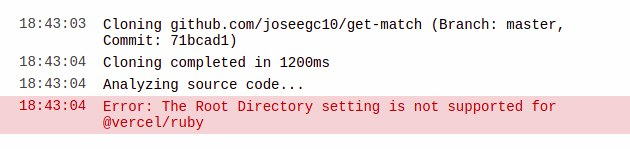
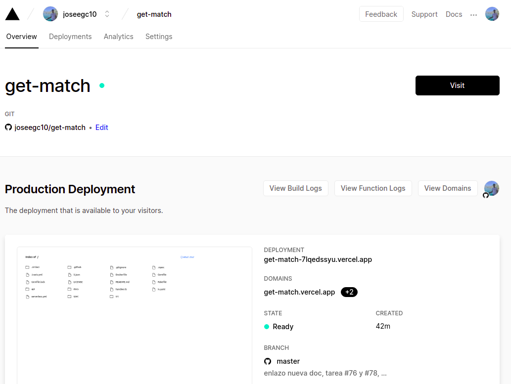
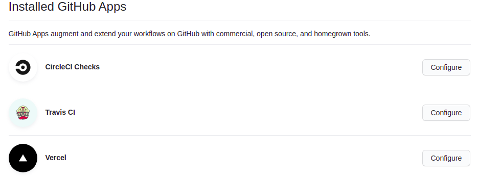

# Vercel

Vercel es una plataforma en la nube para sitios estáticos y funciones Serverless. Esto nos permite alojar sitios web y servicios web que se implementan de forma instantánea y escalan automáticamente, por lo que no necesitan supervisión y mantenimiento de servidores.

## Ventajas de Vercel

- Despliegue sencillo.
- Integración con GitHub, GitLab, Faro, etc.
- Posibilidad de despliegue con git push.
- Posibilidad de consigurar un dominio personalizado.
- Tier gratuito.

## Conexión con GitHub

De nuevo, podemos conectarnos a Vercel de la misma forma que explicamos por ejemplo para Travis. Debemos registarnos con GitHub y dar acceso al repositorio. Una vez hemos hecho eso, seleccionamos en la pantalla principal el boton de importar proyecto, elegimos que lo hacemos a traves de github y ponemos la url al repositorio que queremos importar.

Posteriormente, nos piden elegir la carpeta root. En el caso de Vercel con ruby, al encontrarse este en fase alpha, no nos dejan elegir una carpeta distinta del directorio principal, provocando el siguiente error en caso de que elijamos una diferente:



Por ello, he tenido que hacer deploy de todo el repositorio, quedando de la siguiente forma una vez está importado:



Con ello, se crea una conexión con github a traves de una github app, a partir de la cual cada vez que hagamos push a nuestro repositorio se hará un deploy a Vercel. Esto se puede demostrar con la siguiente imagen:



## Datos usados y agradecimientos

Para que mis funciones Serverless tuvieran una funcionalidad real, he hecho uso de un repositorio que contiene datos sobres las ligas de fútbol, actualizándose automáticamente. El repositorio es [este](https://github.com/openfootball/football.json).

Este repositorio contiene los datos de las ligas de fútbol desde la temporada 2010-11 hasta la actual, incluyendo las principal ligas Europeas.

En mi caso, he usado los datos sobre la temporada actual de la liga Española, por lo que estas funciones Serverless han podido usar datos reales gracias a dicho repositorio.

## Uso de Vercel

Para hacer uso de Vercel, este exige una estructura de directorios concreta. Dentro del directorio que hemos marcado como root, debe existir una carpeta api, donde se encontrará el archivo que va a contener nuestra función Serverless. Este archivo se puede consultar [aquí](../../api/index.rb).

## Integración con el proyecto

Para conseguir una integración con el resto del proyecto, he creado la función Serverless de tal forma que se avance la [HU3: Como usuario, me gustaría poder consultar los días que hace que se jugó un partido o los días que quedan para que se juegue](https://github.com/joseegc10/get-match/issues/32), siendo este un caso particular, pues nos permite consultar los días hasta el próximo partido.

## Código de la función

En primer lugar, he hecho una función auxiliar para la lectura de datos desde el repositorio que expliqué en el apartado anterior.

En segundo lugar, he creado una función auxiliar para que a partir de un equipo y los datos obtenidos en la función anterior, me permita obtener el número de días que quedan para el próximo partido de dicho equipo, en caso de que este pertenezca a la liga Española, notificándolo también en caso de que no sea un equipo de la liga.

Por último, he creado el objeto Handler en el que se basa la función Serverless. El código es el siguiente:

```ruby
Handler = Proc.new do |req, res|
    res.status = 200
    res['Content-Type'] = 'application/json; charset=utf-8'
  
    equipo = req.query['equipo'] || 'Real Madrid'

    partidos, nombresEquipos = cargaDatos()

    dias = proximoPartido(partidos, equipo)

    if dias != -1
        if dias == 0
            msg = "El próximo partido es hoy"
        elsif dias == 1
            msg = "Queda #{dias} día para el próximo partido del #{equipo}"
        else
            msg = "Quedan #{dias} días para el próximo partido del #{equipo}"
        end
    else
        msg = "#{equipo} no es un equipo de la Liga Española"
    end
  
    res.body = {equipo: equipo, diasRestantes: dias, mensaje: msg}.to_json
end
```

Primero, establecemos el status de la respuesta (código 200: respuesta sin errores) y el tipo del objeto que va a ir en el cuerpo del mensaje, en nuestro caso un json y con codificación utf-8.

Como se puede observar en el código anterior, esperamos recibir en el request el equipo del cual queremos saber el número de días hasta el próximo partido. En caso de que no lo recibamos, usamos por defecto el equipo Real Madrid.

Posteriormente, cargamos los datos y obtenemos el número de días con las funciones que comenté anteriormente.

Después, en función de los días recibimos creamos un mensaje que sea explicativo para el usuario.

Por último, establecemos el json que va a ir en el cuerpo de la respuesta. Este va a contener el equipo, los días restantes y el mensaje explicativo.

## Test del código

Como siempre, es necesario testear todo el código que creamos. El archivo en el que se realizan los test de dicho código se puede consultar [aquí](../../spec/index_spec.rb).

## Despliegue

El despliegue a Vercel se puede hacer de dos formas:

1. Mediante el uso de git push. Al tener conectado nuestro repositorio a Vercel, con cada push se va a hacer deploy de nuestro proyecto a Vercel.

2. Mediante el CLI de Vercel. Este lo descargamos con `npm i -g vercel`, mientras que para hacer deploy simplemente ejecutamos `vercel` en el directorio donde tengamos la carpeta api.

En la siguiente imagen se puede ver el correcto deploy a Vercel:


## Prueba de funcionamiento

Para probar el correcto funcionamiento de nuestra función, podemos irnos a [https://get-match.vercel.app/api?equipo=Granada%20CF](https://get-match.vercel.app/api?equipo=Granada%20CF).

Como se puede observar, devuelve correctamente el próximo partido del Granada.
